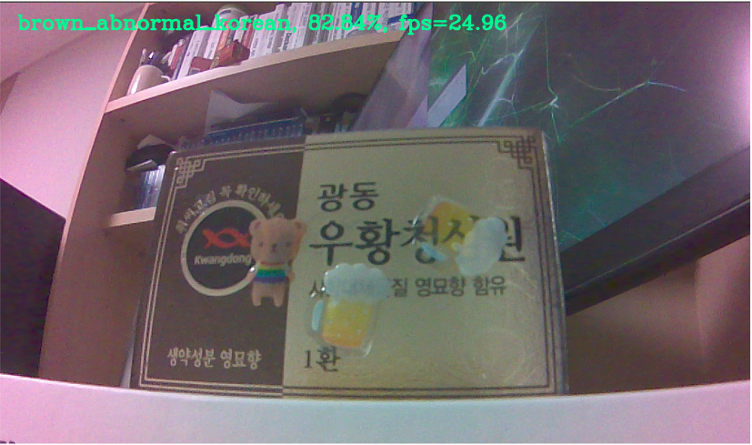
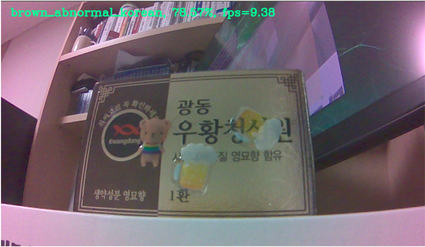

# End-to-end AIoT w/ SageMaker and Greengrass 2.0 on NVIDIA Jetson Nano

***[Note] This hands-on is for NVIDIA Jetson nano, but with only a few lines of code, it works smoothly on NVIDIA Jetson Xavier and Raspberry Pi.***

This hands-on lab starts with Machine Learning(Hereinafter referred to as ML) steps such as data preparing, model training, and model compiling, and then deals with creating and deploying Greengrass v2 components and recipes from scratch on NVIDIA Jetson nano devices. Each folder can be run independently, and you can omit ML Hands-on if you have already your own compiled models.

- `sm-model-train-compile`: ML part (Amazon SageMaker)
- `ggv2-deploy-on-device`: IoT part (AWS IoT Greengrass 2.0, when deployed to on-device)
- `ggv2-deploy-on-cloud`: IoT part (AWS IoT Greengrass 2.0, when deploying to cloud instance)
- 
`ggv2-deploy-on-cloud` is used for IoT/ML workshops.

## 1. ML Part: Compile your ML model using Pytorch Framework and Amazon SageMaker

In the ML part, you can freely prepare your own data, organize a folder, and execute the code, so that even ML beginners can easily train/compile your own model. Does your data exceed gigabytes? In consideration of large data, PyTorch DDP-based distributed training was also implemented.

Let's take an example of raw image folder.

**Example 1)** Training a dog and cat classification model
```
raw
├── cat
└── dog
```

**Example 2)** Example of good/defective distinction in the production line (Included in the `ggv2-deploy-on-device/raw` folder)

```
raw
├── brown_abnormal_chinese: Chinese characters are written on the brown product box and it is abnormal.
├── brown_abnormal_korean: Korean characters are written on the brown product box and it is abnormal.
├── brown_normal_chinese: Chinese characters are written on the brown product box and it is normal.
├── brown_normal_korean: Korean characters are written on the brown product box and it is normal.
├── no_box: There are no boxes. However, sometimes you can see the box edges.
├── red_abnormal: Red product box and it is abnormal.
└── red_normal: Red product box and it is normal.
```

Note: This dataset was taken by the author himself with a NVIDIA Jetson nano CSI camera in preparation for AWS IoT Smart Factory Demo and images from the Internet were not used at all. 

The packaging box images of the dataset are the packaging boxes of Woohwang Cheongsimwon provided with the support of Kwang Dong Pharmaceutical Co.,Ltd.(http://www.ekdp.com), and the camera shooting of the dataset was made with Turck Korea(https://www.turck.kr) inspection equipment sponsored by Turck Korea.

Please refer to the raw dataset folder(`ggv2-deploy-on-device/raw`) corresponding to Example 2 for reference.
- Reference: [AWS Smart Factory with Turck Korea](https://www.youtube.com/watch?v=R0sMMphzOhw)


## 2. IoT Part: On-Device ML Inference with AWS IoT Greengrass 2.0

You can directly copy the compiled model from the ML part to NVIDIA Jetson nano for inference, but in real production environments, you need to register multiple devices at once. At this point, you can register your own Greengrass-v2 component and deploy it to multiple edge devices conveniently. In the future, based on this, it is also possible to publish inference data to MQTT to detect Model/Data Drift.

All the codes work normally, but there are many parts that need to be changed manually, so automation through CDK is recommended in the future.

### 2.0. NVIDIA Jetson Nano setup (if you have not done)
- See [README_jetson_nano_setup.md](README_jetson_nano_setup.md)

### 2.1. Optional: Simple Test
```bash
$ cd artifacts

# Single image inference
$ python3 test_dlr.py

# Camera w/ real-time inference
$ python3 test_camera_dlr.py

# Camera w/ real-time inference (write captured images)
$ python3 test_camera_dlr_write.py

# Flask Camera
$ export DEVICE_IP='[YOUR IP]'
$ python3 flask_camera.py

# Flask Camera w/ real-time inference
$ python3 flask_camera_dlr.py
```

### 2.2. Optional, but Recommended: Shell Script Test
```bash
$ cd artifacts
$ chmod +x run.sh run_flask.sh

# No Camera: Real-time inference for samples images
$ ./run.sh -c 0

# Camera: Real-time inference 
$ ./run.sh -c 1 

# Flask Camera w/ real-time inference
$ ./run_flask.sh -i [YOUR-DEVICE-IP] -p [YOUR-PORT]
# ./run_flask.sh -i 192.168.200.200 -p 2345
```

### 2.3. AWS IoT Greengrass setup (if you have not done)

[Caution] This method is very insecure and not suitable for production. Please refer to [Install AWS IoT Greengrass Core software with AWS IoT fleet provisioning](https://docs.aws.amazon.com/greengrass/v2/developerguide/fleet-provisioning.html) for more appropriate settings.

1. Install AWS CLI V2 (Linux ARM)
```bash
$ curl "https://awscli.amazonaws.com/awscli-exe-linux-aarch64.zip" -o "awscliv2.zip"
$ unzip awscliv2.zip
$ sudo ./aws/install
```

2. Install JDK
```bash
$ sudo apt install default-jdk
$ java -version
```

3. AWS configure and access key, secret key environment variable setting
```bash
$ aws configure # Set up your credentials
$ export AWS_ACCESS_KEY_ID=[YOUR-KEY-ID]
$ export AWS_SECRET_ACCESS_KEY=[YOUR-SECRET-ACCESS-KEY]
```

4. Download and install AWS IoT Greengrass V2 core software
- See https://docs.aws.amazon.com/greengrass/v2/developerguide/quick-installation.html

### 2.4. Register AWS IoT Greengrass Component 
1. Modify `config.json` first.
2. Run `create_gg_component.sh`. If running on a Macbook, run `create_gg_component_mac.sh`.<br>
   When this cell script is executed, the local json recipe and `artifacts/config_utils.py` are automatically modified by reflecting the changes made in the `config.json` setting, the files in the `artifacts` folder are compressed with zip, uploaded to the your S3 bucket, and finally the Greengrass component is automatically registered.

```bash
$ ./create_gg_component.sh
```

### 2.5. Deploy to your Edge devices
Once the component is registered, it can be easily deployed via the AWS UI or IoT Greengrass CLI. Please refer to the developer guide.
- https://docs.aws.amazon.com/greengrass/v2/developerguide/manage-deployments.html.
  
## Experiments
The experimental results below are not rigorous. Please refer only to check the approximate FPS(Frames Per Second).
- Model: MobileNet-v2 Image Classification
- Framework: PyTorch 1.6.0 	
- CSI Camera Input size: 1280 x 720 x 3 
- DLR Runtime Version: 1.9.0
  
Overclocking will speed it up by about 4-5 frames. But, it requires a sufficient cooling system.
<table>
    <thead>
        <tr>
            <th></th>
            <th colspan=2>Vanilla PyTorch (Built-in OpenCV 4.1.1)</th>
            <th colspan=2>Compiled w/ SageMaker Neo (Built-in OpenCV 4.1.1)</th>
            <th colspan=2>Compiled w/ SageMaker Neo (Build OpenCV 4.5.3 from scratch)</th> 
        </tr>
    </thead>
    <tbody>
        <tr>
            <td>CPU/GPU</td>
            <td>CPU</td>
            <td>GPU</td>
            <td>CPU</td>
            <td>GPU</td>
            <td>CPU</td>
            <td>GPU</td>
        </tr>
        <tr>
            <td>Model Loading Time</td>
            <td>~50 secs</td>
            <td>~90 secs</td>
            <td>2~3 secs</td>
            <td>~40 secs</td>
            <td>2~3 secs</td>  
            <td>~40 secs</td>   
        </tr>
        <tr>
            <td>FPS</td>
            <td>0.16~0.18</td>
            <td>8~9</td>
            <td>5~6</td>
            <td>16~17</td>
            <td>8~10</td>
            <td>23~25</td>
        </tr>        
    </tbody>
</table>

<table>
    <tbody>
        <tr>
            <td></td>
            <td></td>
        </tr>
        <tr>
            <td>Image classification w/ SageMaker Neo<br>(GPU enabled, Gstreamer on OpenCV 4.5.3)</td>
            <td>Image classification w/ SageMaker Neo<br>(GPU disenabled, Gstreamer on OpenCV 4.5.3)</td>
        </tr>
    </tbody>
</table>

## License Summary

This sample code is provided under the MIT-0 license. See the LICENSE file.