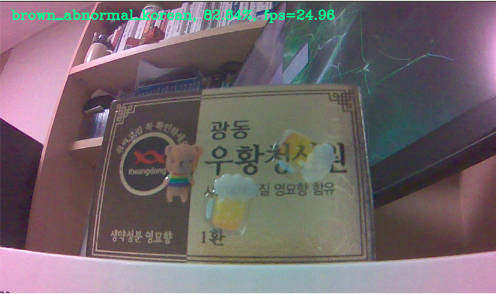
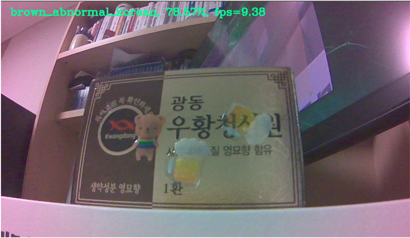

# End-to-end AIoT w/ SageMaker and Greengrass 2.0 on NVIDIA Jetson Nano (Korean)

***[Note] 이 핸즈온은 NVIDIA Jetson nano용이지만, 몇 줄의 코드만으로 NVIDIA Jetson Xavier 및 Raspberry Pi에서 원활하게 작동합니다.***

이 핸즈은랩은 데이터 준비, 모델 훈련 및 모델 컴파일과 같은 기본적인 머신 러닝(이하 ML) 절차와 NVIDIA Jetson nano 디바이스에서 Greengrass v2 컴포넌트 및 레시피를 밑바닥부터 생성하고 배포하는 방법을 다룹니다. 각 폴더는 독립적으로 실행할 수 있으며, 이미 모델을 컴파일한 경우 ML 파트를 생략할 수 있습니다.

- `sm-model-train-compile`: ML part (Amazon SageMaker)
- `ggv2-deploy-on-device`: IoT part (AWS IoT Greengrass 2.0)

## 1. ML Part: Compile your ML model using Pytorch Framework and Amazon SageMaker

ML 파트에서는 ML 초보자도 쉽게 자신의 모델을 훈련/컴파일할 수 있도록 여러본의 데이터를 자유롭게 준비하고 폴더를 구성 후 코드를 실행할 수 있습니다. 데이터가 기가바이트를 초과한다면 어떻게 해야 할까요? 대용량 데이터를 고려하여 PyTorch DDP 기반의 분산 훈련도 구현하였습니다.

raw 이미지 폴더를 구성하는 예시를 들어 보겠습니다.

**Example 1)** 개/고양이 분류 모델 훈련
```
raw
├── cat
└── dog
```

**Example 2)** 생산 라인에서의 양품/불량 분류 모델 훈련 (`ggv2-deploy-on-device/raw` 폴더에 포함되었습니다.)

```
raw
├── brown_abnormal_chinese: 갈색 제품에 한자가 적혀 있는 불량 박스입니다.
├── brown_abnormal_korean: 갈색 제품에 한글이 적혀 있는 불량 박스입니다.
├── brown_normal_chinese: 갈색 제품에 한자가 적혀 있는 양품 박스입니다.
├── brown_normal_korean: 갈색 제품에 한글이 적혀 있는 양품 박스입니다.
├── no_box: 박스가 없습니다. 하지만, 때때로 박스 일부분들을 볼 수 있습니다.
├── red_abnormal: 적색 제품이며 불량 박스입니다.
└── red_normal: 적색 제품이며 양품 박스입니다.
```

Note: 이 데이터셋은 AWS IoT Smart Factory 데모를 준비하기 위해 저자가 직접 NVIDIA Jetson nano CSI 카메라로 촬영했으며 인터넷 이미지는 전혀 사용하지 않았습니다. 데이터셋의 포장 박스 이미지는 광동 제약(http://www.ekdp.com) 협찬으로 제공된 우환청심원 포장 박스들이며, 데이터셋 촬영은 터크코리아(https://www.turck.kr) 후원으로 터크코리아 검사 장비에서 이루어졌습니다.

Example 2의 데이터셋 샘플은 raw 데이터셋 폴더(`ggv2-deploy-on-device/raw`)를 참고하시기 바랍니다.
- Reference: [AWS Smart Factory with Turck Korea](https://www.youtube.com/watch?v=R0sMMphzOhw)

## 2. IoT Part: On-Device ML Inference with AWS IoT Greengrass 2.0

컴파일된 모델을 ML 파트에서 NVIDIA Jetson nano로 직접 복사하여 추론할 수 있지만 실제 프로덕션 환경에서는 한 번에 여러 디바이스들을 등록해야 합니다. 이 때, Greengrass-v2 컴포넌트를 등록하면 여러 에지 디바이스에 편리하게 배포할 수 있습니다. 향후 이를 기반으로 추론 데이터를 MQTT에 게시하여 Model/Data Drift를 감지하는 것도 가능합니다.

모든 코드는 정상적으로 동작하지만 수동 작업이 많기 때문에 향후 CDK(Cloud Development Kit)를 통한 자동화를 권장합니다.

### 2.0. NVIDIA Jetson Nano setup (if you have not done)
- [README_jetson_nano_setup.md](README_jetson_nano_setup.md)를 참조하세요.

### 2.1. Optional: Simple Test
```bash
$ cd artifacts

# Single image inference
$ python3 test_dlr.py

# Camera w/ real-time inference
$ python3 test_camera_dlr.py

# Camera w/ real-time inference (write captured images)
$ python3 test_camera_dlr_write.py

# Flask Camera
$ export DEVICE_IP='[YOUR IP]'
$ python3 flask_camera.py

# Flask Camera w/ real-time inference
$ python3 flask_camera_dlr.py
```

### 2.2. Optional, but Recommended: Shell Script Test
```bash
$ cd artifacts
$ chmod +x run.sh run_flask.sh

# No Camera: Real-time inference for samples images
$ ./run.sh -c 0

# Camera: Real-time inference 
$ ./run.sh -c 1 

# Flask Camera w/ real-time inference
$ ./run_flask.sh -i [YOUR-DEVICE-IP] -p [YOUR-PORT]
# ./run_flask.sh -i 192.168.200.200 -p 2345
```

### 2.3. AWS IoT Greengrass setup (if you have not done)

[주의] 이 방법은 보안에 취약하고 프로더션에 적합하지 않습니다. 더 적절한 설정은 [AWS IoT 플릿 프로비저닝으로 AWS IoT Greengrass Core 소프트웨어 설치](https://docs.aws.amazon.com/greengrass/v2/developerguide/fleet-provisioning.html)를 참조하세요.

1. AWS CLI V2 (Linux ARM) 를 설치하세요.
```bash
$ curl "https://awscli.amazonaws.com/awscli-exe-linux-aarch64.zip" -o "awscliv2.zip"
$ unzip awscliv2.zip
$ sudo ./aws/install
```

2. JDK를 설치하세요.
```bash
$ sudo apt install default-jdk
$ java -version
```

3. AWS configure and access key, secret key environment variable setting
```bash
$ aws configure # Set up your credentials
$ export AWS_ACCESS_KEY_ID=[YOUR-KEY-ID]
$ export AWS_SECRET_ACCESS_KEY=[YOUR-SECRET-ACCESS-KEY]
```

4. AWS IoT Greengrass V2 core software를 다운로드하고 설치하세요.
-  참조: https://docs.aws.amazon.com/greengrass/v2/developerguide/quick-installation.html

### 2.4. Register AWS IoT Greengrass Component 
1. `config.json`을 먼저 수정하세요.
2. `create_gg_component.sh`를 실행하세요. 만약 Macbook에서 실행한다면 `create_gg_component_mac.sh`을 실행하세요.<br>
   이 셀스크립트를 실행하면 `config.json` 설정에서 변경된 내용을 반영하여 로컬의 json recipe와 `artifacts/config_utils.py`을 자동으로 수정해 주고 `artifacts` 폴더의 파일을 zip으로 압축하여 여러분의 S3 버킷으로 업로드 후, 마지막으로 Greengrass 컴포넌트를 자동으로 등록합니다.

```bash
$ ./create_gg_component.sh
```

### 2.5. Deploy to your Edge devices
컴포넌트가 등록되었다면 AWS UI나 Greengrass CLI로 쉽게 배포할 수 있습니다. 개발자 가이드를 참조해 주세요.
- https://docs.aws.amazon.com/greengrass/v2/developerguide/manage-deployments.html.
   
## Experiments
아래의 실험 결과는 엄밀하지 않습니다. 대략적인 FPS(Frames Per Second)만 확인해 주세요.
- Model: MobileNet-v2 Image Classification
- Framework: PyTorch 1.6.0
- CSI Camera Input size: 1280 x 720 x 3 
- DLR Runtime Version: 1.9.0

오버클러킹을 수행하면 약 4~5프레임이 향상됩니다. 하지만 오버클러킹은 충분한 쿨링 시스템을 갖춰야 합니다.
<table>
    <thead>
        <tr>
            <th></th>
            <th colspan=2>Vanilla PyTorch (Built-in OpenCV 4.1.1)</th>
            <th colspan=2>Compiled w/ SageMaker Neo (Built-in OpenCV 4.1.1)</th>
            <th colspan=2>Compiled w/ SageMaker Neo (Build OpenCV 4.5.3 from scratch)</th> 
        </tr>
    </thead>
    <tbody>
        <tr>
            <td>CPU/GPU</td>
            <td>CPU</td>
            <td>GPU</td>
            <td>CPU</td>
            <td>GPU</td>
            <td>CPU</td>
            <td>GPU</td>
        </tr>
        <tr>
            <td>Model Loading Time</td>
            <td>~50 secs</td>
            <td>~90 secs</td>
            <td>2~3 secs</td>
            <td>~40 secs</td>
            <td>2~3 secs</td>  
            <td>~40 secs</td>   
        </tr>
        <tr>
            <td>FPS</td>
            <td>0.16~0.18</td>
            <td>8~9</td>
            <td>5~6</td>
            <td>16~17</td>
            <td>8~10</td>
            <td>23~25</td>
        </tr>        
    </tbody>
</table>

<table>
    <tbody>
        <tr>
            <td></td>
            <td></td>
        </tr>
        <tr>
            <td>Image classification w/ SageMaker Neo<br>(GPU enabled, Gstreamer on OpenCV 4.5.3)</td>
            <td>Image classification w/ SageMaker Neo<br>(GPU disenabled, Gstreamer on OpenCV 4.5.3)</td>
        </tr>
    </tbody>
</table>

## License Summary

이 샘플 코드는 MIT-0 라이선스에 따라 제공됩니다. LICENSE 파일을 참조하십시오.